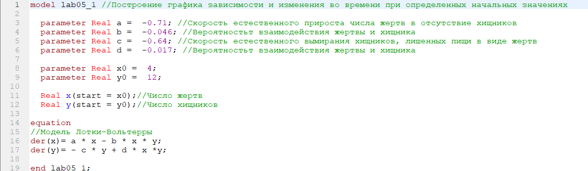
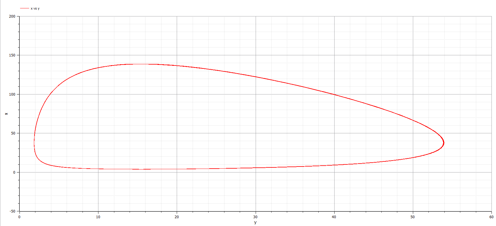
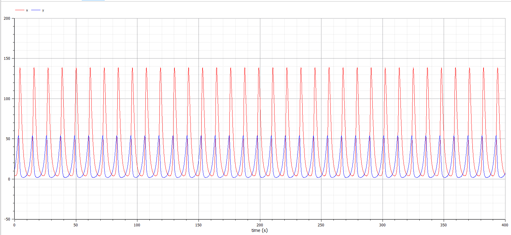
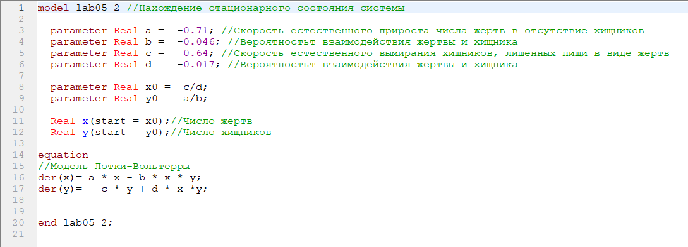
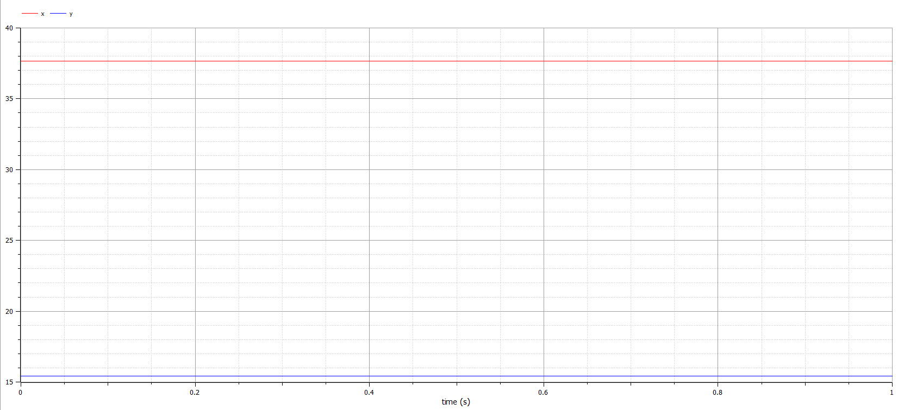

---
# Front matter
lang: ru-RU
title: "Лабораторная работа №5. Вариант 50."
subtitle: "Модель хищник-жертва"
author: "Силкина Мария Александровна"

# Formatting
toc-title: "Содержание"
toc: true # Table of contents
toc_depth: 2
lof: true # List of figures
lot: true # List of tables
fontsize: 12pt
linestretch: 1.5
papersize: a4paper
documentclass: scrreprt
polyglossia-lang: russian
polyglossia-otherlangs: english
mainfont: PT Serif
romanfont: PT Serif
sansfont: PT Sans
monofont: PT Mono
mainfontoptions: Ligatures=TeX
romanfontoptions: Ligatures=TeX
sansfontoptions: Ligatures=TeX,Scale=MatchLowercase
monofontoptions: Scale=MatchLowercase
indent: true
pdf-engine: lualatex
header-includes:
  - \linepenalty=10 # the penalty added to the badness of each line within a paragraph (no associated penalty node) Increasing the value makes tex try to have fewer lines in the paragraph.
  - \interlinepenalty=0 # value of the penalty (node) added after each line of a paragraph.
  - \hyphenpenalty=50 # the penalty for line breaking at an automatically inserted hyphen
  - \exhyphenpenalty=50 # the penalty for line breaking at an explicit hyphen
  - \binoppenalty=700 # the penalty for breaking a line at a binary operator
  - \relpenalty=500 # the penalty for breaking a line at a relation
  - \clubpenalty=150 # extra penalty for breaking after first line of a paragraph
  - \widowpenalty=150 # extra penalty for breaking before last line of a paragraph
  - \displaywidowpenalty=50 # extra penalty for breaking before last line before a display math
  - \brokenpenalty=100 # extra penalty for page breaking after a hyphenated line
  - \predisplaypenalty=10000 # penalty for breaking before a display
  - \postdisplaypenalty=0 # penalty for breaking after a display
  - \floatingpenalty = 20000 # penalty for splitting an insertion (can only be split footnote in standard LaTeX)
  - \raggedbottom # or \flushbottom
  - \usepackage{float} # keep figures where there are in the text
  - \floatplacement{figure}{H} # keep figures where there are in the text
---

# Цель работы

Изучить модель Лотки-Вольтерры, которая отражает взаимодействие двух видов типа "хищник-жертва". 

# Задачи

1. Построить график зависимости численности хищников от численности жертв.
2. Построить графики изменения численности хищников и численности жертв.
3. Найти стационарное состояние системы.

# Теоретическое введение

Модель "Хищник-жертва" имеет следующий вид:
	$$ 
                \begin{cases}
                    \frac{dx}{dt} = ax(t)-bx(t)y(t)
                    \\
                    \frac{dy}{dt} = -cy(t)+dx(t)y(t)
                 \end{cases}
        $$
где 
a - скорость естественного прироста числа жертв в отсутствие хищников;
c - естественное вымирание хищников, лишенных пищи в виде жертв;
b и d - вероятность взаимодействия жертвы и хищника считается пропорциональной как количеству жертв, так и числу самих хищников;
x - число жертв;
y - число хищников.

Данная двувидовая модель основывается на следующих предположениях:

1. Численность популяции жертв x и хищников y зависят только от времени.

2. В отсутствии взаимодействия численность видов изменяется по модели Мальтуса, при этом число жертв увеличивается, а число хищников падает.

3. Естественная смертность жертвы и естественная рождаемость хищника считаются несущественными.

4. Эффект насыщения численности обеих популяций не учитывается.

5. Скорость роста численности жертв уменьшается пропорционально численности хищников.
 

# Выполнение лабораторной работы

## Код программы 

Код програмы написан на языке Modelica. Ниже приведено два варианта кода, в зависимости от задачи.

model lab05_1 //Построение графика зависимости и изменения во времени при определенных начальных значениях

  parameter Real a =  -0.71; //Скорость естественного прироста числа жертв в отсутствие хищников
  parameter Real b =  -0.046; //Вероятностьт взаимодействия жертвы и хищника 
  parameter Real c =  -0.64; //Скорость естественного вымирания хищников, лишенных пищи в виде жертв
  parameter Real d =  -0.017; //Вероятностьт взаимодействия жертвы и хищника 
  
  parameter Real x0 =  4;
  parameter Real y0 =  12;
  
  Real x(start = x0);//Число жертв
  Real y(start = y0);//Число хищников
  
equation
//Модель Лотки-Вольтерры
der(x)= a * x - b * x * y;
der(y)= - c * y + d * x *y;

end lab05_1;

model lab05_2 //Нахождение стационарного состояния системы

  parameter Real a =  -0.71; //Скорость естественного прироста числа жертв в отсутствие хищников
  parameter Real b =  -0.046; //Вероятностьт взаимодействия жертвы и хищника 
  parameter Real c =  -0.64; //Скорость естественного вымирания хищников, лишенных пищи в виде жертв
  parameter Real d =  -0.017; //Вероятностьт взаимодействия жертвы и хищника 
  
  parameter Real x0 =  c/d;
  parameter Real y0 =  a/b;
  
  Real x(start = x0);//Число жертв
  Real y(start = y0);//Число хищников
  
equation
//Модель Лотки-Вольтерры
der(x)= a * x - b * x * y;
der(y)= - c * y + d * x *y;

end lab05_2;

## Ход работы

Уравнение модели "хищник-жертва" для моего варианта имеет следующий вид:
	$$ 
                \begin{cases}
                    \frac{dx}{dt} = -0.71x(t)+0.046x(t)y(t)
                    \\
                    \frac{dy}{dt} = 0.64y(t)-0.017x(t)y(t)
                 \end{cases}
        $$
Начальные условия: x_0 = 4 и y_0 = 12.

Мною был написан код программы, который выводит графики, нужные в задачах. (рис 1. -@fig:001)  

{ #fig:001 width=70% }

Ниже приведен график зависимости численности популяции хищников от численности популяции жертв. (рис 2. -@fig:001)  

{ #fig:001 width=70% }

Для второй задачи требуется построить графики изменения численности популяции хищников и численности популяции жертв с течением времени. Выведен данный график был при помощи кода, представленного выше. (рис 3. -@fig:001)  

{ #fig:001 width=70% }

Для нахождения стационарного состояния системы, мне необходимо приравнять производные каждой из функций x и y к нулю и выразить значения y и x соответственно. Сделала я это таким образом: 

$$ x_0 = \frac{b}{d} = \frac{0.64}{0.017} \approx 37.647  $$
$$ y_0 = \frac{a}{c} = \frac{0.71}{0.046} \approx 15.4348  $$

Для реализации нахождения стационарного состояния системы, мною был написан программный код. (рис 4. -@fig:001)   

{ #fig:001 width=70% }

При стационарном состоянии системы значения числа жертв и хищников не меняется во времени и наблюдать это можно на приведенном ниже рафике. (рис 5. -@fig:001)  

{ #fig:001 width=70% }

# Выводы

При выполнении данной лабораторной работы я изучила  модель взаимодействия двух видов типа «хищник — жертва», выполнив задания, данные мне, а именно: построила графики и нашла стационарное состояние системы. 